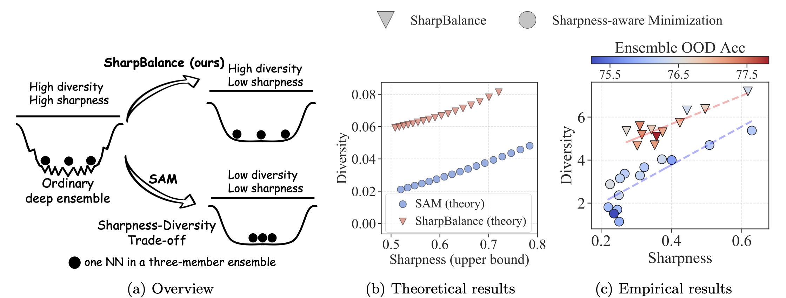
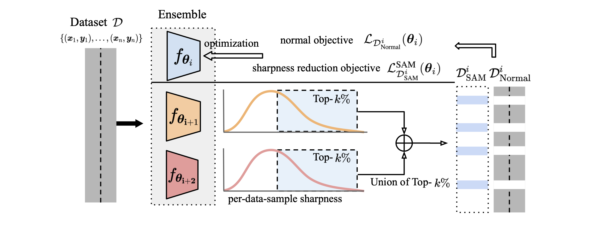
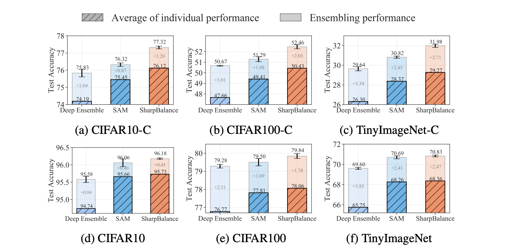

# Sharpness-diversity tradeoff: improving flat ensembles with SharpBalance

[Haiquan Lu](https://haiquanlu.github.io/), [Xiaotian Liu](https://scholar.google.com/citations?user=32r5znUAAAAJ&hl=en), [Qunli Li](https://www.linkedin.com/in/qunli-li-594385236/), [Yefan Zhou](https://yefanzhou.github.io/), [Kurt Keutzer](https://people.eecs.berkeley.edu/~keutzer/), [Michael W. Mahoney](https://www.stat.berkeley.edu/~mmahoney/), [Yujun Yan](https://sites.google.com/umich.edu/yujunyan/home), [Huanrui Yang](https://sites.google.com/view/huanrui-yang), [Yaoqing Yang](https://sites.google.com/site/yangyaoqingcmu/)

**Nankai University, Dartmouth College, University of California San Diego, University of California at Berkeley.**

[Full paper](https://arxiv.org/pdf/2407.12996)




## Abstract
Recent studies on deep ensembles have identified the sharpness of the local minima of individual learners and the diversity of the ensemble members as key factors in improving test-time performance. Building on this, our study investigates the interplay between sharpness and diversity within deep ensembles, illustrating their crucial role in robust generalization to both in-distribution (ID) and out-of-distribution (OOD) data. We discover a trade-off between sharpness and diversity: minimizing the sharpness in the loss landscape tends to diminish the diversity of individual members within the ensemble, adversely affecting the ensemble's improvement. The trade-off is justified through our rigorous theoretical analysis and verified empirically through extensive experiments. To address the issue of reduced diversity, we introduce SharpBalance, a novel training approach that balances sharpness and diversity within ensembles. Theoretically, we show that our training strategy achieves a better sharpness-diversity trade-off. Empirically, we conducted comprehensive evaluations in various data sets (CIFAR-10, CIFAR-100, TinyImageNet) and showed that SharpBalance not only effectively improves the sharpness-diversity trade-off but also significantly improves ensemble performance in ID and OOD scenarios.

## Update
- [x] (12.8.2024) We released the code for SharpBalance.

## Setup
Installation instructions can be found in [INSTALL.md](INSTALL.md).

## Main results


<p style="text-align: center;"><i>Main results: SharpBalance improves the overall ensembling performance and mitigates
the reduced ensembling improvement caused by sharpness-diversity trade-off.The three-member ResNet18 ensemble is trained with different methods on three datasets. The first row reports the OOD accuracy and the second row reports the ID accuracy.</i></p>

## Usage
The [scripts](scripts) directory contains the bash commands to replicate the main results (Figure 7) in our paper.

Below is an example command for training and evaluation.
### Training
* Script example of runing deep ensemble 
```sh
python main.py \
    --data cifar100 \
    --data_path [path to dataset] \
    --model resnet18 \
    --seed "13 17 27" \
    --save_path [path to save models]
```

* Script example of runing deep ensemble with sam
```sh
python main.py \
    --data cifar100 \
    --data_path [path to dataset] \
    --model resnet18 \
    --seed "13 17 27" \
    --sam True \
    --rho ${rho}
    --save_path [path to save models]
```

* Script example of runing sharpbalance
```sh
python main.py \
    --data cifar100 \
    --data_path [path to dataset] \
    --model resnet18 \
    --seed "13 17 27" \
    --sam True \
    --rho 0.2 \
    --flat_ratio 0.5 \
    --initial_epochs 100
    --save_path [path to save models]
```

### Evaluation of diversity and shapeness 
* Script example of measuring diversity (DER)
```sh
python measure_diversity.py \
    --dataset [cifar10 or cifar100 or tiny_imgnet] \
    --data_path [path to downloaded data] \
    --model resnet18 \
    --resume [path to ensemble models] \
    --mode disagreement \
    --save [path to save results]
```

* Script example of measuring diversity (variance)
```sh
python measure_diversity_variance.py \
    --dataset [cifar10 or cifar100 or tiny_imgnet] \
    --data_path [path to downloaded data] \
    --model resnet18 \
    --resume [path to ensemble models] \
    --mode variance_mse_c \
    --save [path to save results]
```

* Script example of measuring model sharpness
```sh
python measure_sharpness.py \
        --dataset [cifar10 or cifar100 or tiny_imgnet] \
        --data_path ${data_path} \
        --model resnet18 \
        --resume [path to ensemble models] \
        --mode APGD_worst \
        --save [path to save results]
```

### Arguments usage
We provide a quick overview of the arguments:  
- `--data`: We have implemented three dataset, namely ['cifar10', 'cifar100', 'tiny_imgnet'].
- `--data_path`: Directory for loading the dataset you download.
- `--model`: The default model is 'resnet18'
- `--seed`: Three seed to initialize the model and run the training in the ensemble.
- `--save_path`: Specifies the directory where the result will be stored.

### Simulation of theorical results
We have included the simulation code for verifications in the notebook [theoretical_verification.ipynb](theoretical_verification.ipynb). Feel free to have a try !

## Contribution 
Haiquan conducted experiments and contributed to the implementation of the ensembling algorithm, Xiaotian contributed to the theoretical proofs and simulations, Yefan implemented the loss landscape metrics and proposed ideas, Qunli contributed to the experiments in the initial phases.

## Citation
We would appreciate it if you could cite the following paper if you found the repository useful for your work:

```bash
@inproceedings{lu2024sharpbalance,
title={Sharpness-diversity tradeoff: improving flat ensembles with SharpBalance},
author={Lu, Haiquan and Liu, Xiaotian and Zhou, Yefan and Li, Qunli and Keutzer, Kurt and Mahoney, Michael W and Yan, Yujun and Yang, Huanrui and Yang, Yaoqing},
booktitle={Thirty-eighth Conference on Neural Information Processing Systems},
year={2024}
}
```

## License
This project is released under the MIT license. Please see the [LICENSE](LICENSE) file for more information.
